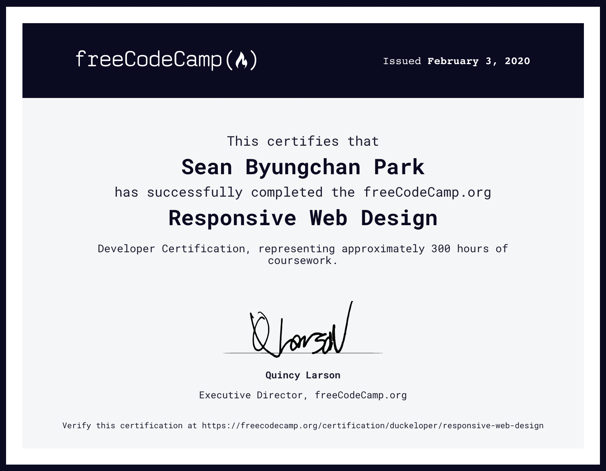
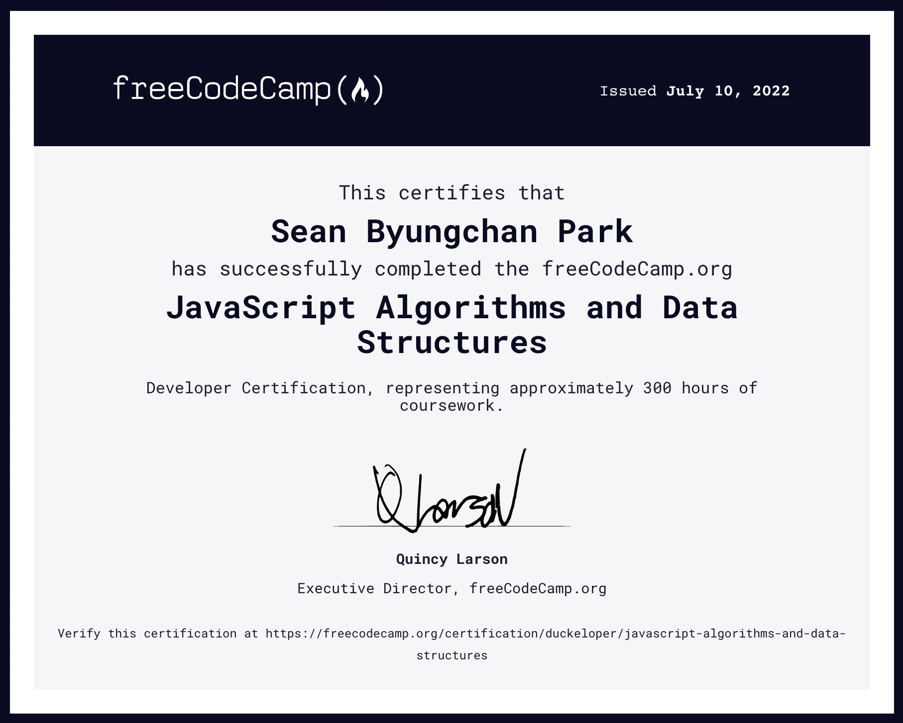

# freeCodeCamp 학습노트

## 1. 리포지토리 소개

본 리포지토리는 [freeCodeCamp](https://www.freecodecamp.org/)에서 학습한 기록을 담고 있습니다. freeCodeCamp는 무료로 개발을 학습할 수 있는 플랫폼이자 개발자들의 커뮤니티입니다.

 

---

 

## 2. 학습 기록

### 2.1 [반응형 웹 디자인 Responsive Web Design](https://www.freecodecamp.org/learn/2022/responsive-web-design/)

 

 

> In this Responsive Web Design Certification, you'll learn the languages that developers use to build webpages: HTML (Hypertext Markup Language) for content, and CSS (Cascading Style Sheets) for design.
>
> First, you'll build a cat photo app to learn the basics of HTML and CSS. Later, you'll learn modern techniques like CSS variables by building a penguin, and best practices for accessibility by building a quiz site.
>
> Finally, you'll learn how to make webpages that respond to different screen sizes by building a photo gallery with Flexbox, and a magazine article layout with CSS Grid.
>
> _- 과정 소개_

 

- 2020년 2월 수료
- 2022년 6월 재수료

 

---

 

### 2.2 [자바스크립트 알고리즘과 자료구조 JavaScript Algorithms and Data Structures](https://www.freecodecamp.org/learn/javascript-algorithms-and-data-structures/)

 

 

> While HTML and CSS control the content and styling of a page, JavaScript is used to make it interactive. In the JavaScript Algorithm and Data Structures Certification, you'll learn the fundamentals of JavaScript including variables, arrays, objects, loops, and functions.
>
> Once you have the fundamentals down, you'll apply that knowledge by creating algorithms to manipulate strings, factorialize numbers, and even calculate the orbit of the International Space Station.
>
> Along the way, you'll also learn two important programming styles or paradigms: Object Oriented Programming (OOP) and Functional Programming (FP).
>
> _- 과정 소개_

 

- 2022년 7월 수료

 

---

 

### 2.3 [프론트엔드 개발 라이브러리 Front End Development Libraries](https://www.freecodecamp.org/learn/front-end-development-libraries/)

 

> Now that you're familiar with HTML, CSS, and JavaScript, level up your skills by learning some of the most popular front end libraries in the industry.
>
> In the Front End Development Libraries Certification, you'll learn how to style your site quickly with Bootstrap. You'll also learn how add logic to your CSS styles and extend them with Sass.
>
> Later, you'll build a shopping cart and other applications to learn how to create powerful Single Page Applications (SPAs) with React and Redux.
>
> _- 과정 소개_

 

- 2022년 7월, VanillaJS에 집중하기 위해 중단
